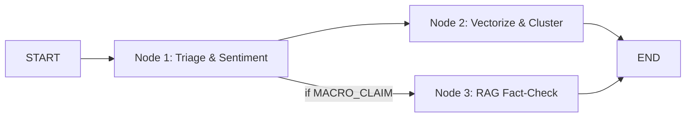
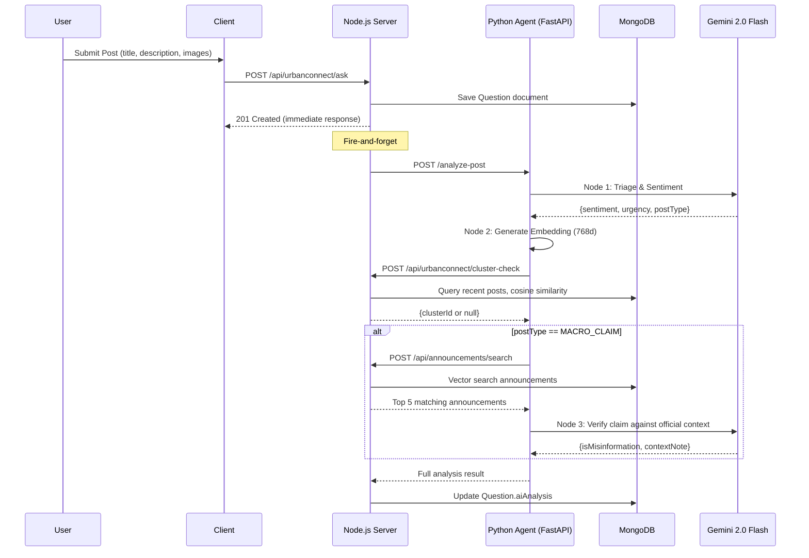

# UrbanConnect Civic Analysis RAG Architecture — Implementation Plan

## Goal

Build a production-ready civic analysis system for UrbanConnect that:
1. **Analyzes every new post** — triage, sentiment, urgency classification
2. **Vectorizes posts** — multimodal embeddings stored in Firestore for clustering
3. **Detects emerging issues** — density-based clustering via vector nearest-neighbor queries within time windows
4. **Detects misinformation** — intent-based triage (Civic Report vs. Macro-Claim) with RAG fact-checking against official announcements
5. **Announcements tab** — read-only feed of synthetic official announcements from Administration entities (SDM, Municipal Corp, etc.), no user comments, max ~20 visible
6. **Admin dashboard** — analytics panel showing sentiment trends, emerging clusters, misinformation flags

---

## Current State Summary

| Component | What Exists | Database |
|---|---|---|
| UrbanConnect Posts | [Question](file:///Users/aryangupta/Documents/Projects/dev/server/src/controllers/urbanconnect.controller.js#148-186) model (title, description, image[], tags, taggedAuthorities, votes) | MongoDB |
| Officials | `Administration` model (city, postName, department) — SDM, Municipal Corp, Fire Dept, etc. | MongoDB |
| Users | [User](file:///Users/aryangupta/Documents/Projects/dev/server/src/controllers/urbanconnect.controller.js#521-616) model (auth0Id, username, email, avatar) | MongoDB |
| Comments | [Comment](file:///Users/aryangupta/Documents/Projects/dev/server/src/controllers/urbanconnect.controller.js#261-304) model (questionId, parentId, body, votes, replyCount) | MongoDB |
| Caching | Redis with 60s TTL on `urbanconnect:questions:*` keys | Redis |
| Agent Service | FastAPI + LangGraph on port 10000, uses `gemini-2.0-flash` and `gemini-embedding-001` (768d) | — |
| Vector Storage | Firestore `FieldValue.vector()` (used for jobs/users/schemes) | Firestore |

---

## Proposed Changes

### Component 1: New MongoDB Models

#### [NEW] [announcementModel.js](file:///Users/aryangupta/Documents/Projects/dev/server/src/models/urbanconnect/announcementModel.js)

A new Mongoose model for **synthetic** official announcements. These are pre-seeded from the 5 existing `Administration` officials and serve as the **ground truth knowledge base** for RAG fact-checking. No user or admin creates these manually — they are populated via a seed script.

```javascript
{
  authority: ObjectId → Administration,  // References existing officials
  title: String,
  body: String,                          // The announcement text (ground truth)
  city: String (indexed),                // Delhi or Mumbai
  department: String,                    // Revenue, Civic, Emergency Services, Police
  embedding: [Number],                   // 768-dim vector (generated during seeding)
  createdAt: Date,
  expiresAt: Date                        // TTL cleanup after ~30 days
}
```

Indexes: `{ city: 1, createdAt: -1 }`, `{ expiresAt: 1 }` (for TTL auto-cleanup)

#### [NEW] [seedAnnouncements.js](file:///Users/aryangupta/Documents/Projects/dev/server/seedAnnouncements.js)

A one-time seed script that populates the `announcements` collection with realistic synthetic announcements from the 5 officials:

| Authority | City | Department | Example Announcements |
|---|---|---|---|
| **SDM** | Delhi | Revenue | Property tax deadline, land survey notices |
| **Municipal Corporation** | Delhi | Civic | Water supply schedules, road construction, waste collection changes |
| **Fire Department** | Delhi | Emergency Services | Fire safety advisories, building evacuation notices |
| **BMC Commissioner** | Mumbai | Civic | Infrastructure updates, flood preparedness, utility maintenance |
| **Traffic Police** | Mumbai | Police | Road closures, traffic diversions, metro construction alerts |

The seed script will:
1. Look up each `Administration` doc by `postName` + `city`
2. Insert 4-5 realistic announcements per official (~20-25 total)
3. Fire-and-forget embed each announcement body via `POST /embed` to the Python agent
4. Store the 768-dim vector in the [embedding](file:///Users/aryangupta/Documents/Projects/dev/agents/brain/embedding_agent.py#16-28) field

```bash
node seedAnnouncements.js
```

#### [MODIFY] [questionModel.js](file:///Users/aryangupta/Documents/Projects/dev/server/src/models/urbanconnect/questionModel.js)

Add new AI-enrichment fields to the existing Question schema:

```diff
+  // AI Analysis Fields (populated by fire-and-forget agent)
+  aiAnalysis: {
+    sentiment: { type: String, enum: ['POSITIVE', 'NEUTRAL', 'NEGATIVE', 'ALARMING'], default: null },
+    sentimentScore: { type: Number, default: null },       // 0.0 to 1.0
+    urgency: { type: String, enum: ['LOW', 'MEDIUM', 'HIGH', 'CRITICAL'], default: null },
+    postType: { type: String, enum: ['CIVIC_REPORT', 'MACRO_CLAIM', 'GENERAL'], default: null },
+    isMisinformation: { type: Boolean, default: null },
+    contextNote: { type: String, default: null },          // RAG-generated correction
+    clusterId: { type: String, default: null },            // Emerging issue cluster ID
+    analyzedAt: { type: Date, default: null },
+  },
+  embedding: { type: [Number], default: null },            // 768-dim post vector
```

---

### Component 2: Python Agent — Civic Analysis LangGraph Pipeline

#### [NEW] [civic_analysis_agent.py](file:///Users/aryangupta/Documents/Projects/dev/agents/brain/civic_analysis_agent.py)

A new LangGraph state graph with 3 nodes + a conditional router:



**State:**
```python
class CivicAnalysisState(TypedDict):
    # Inputs
    post_id: str
    title: str
    description: str
    image_urls: list[str]
    city: str
    
    # Node 1 outputs
    sentiment: str           # POSITIVE/NEUTRAL/NEGATIVE/ALARMING
    sentiment_score: float   # 0.0 - 1.0
    urgency: str             # LOW/MEDIUM/HIGH/CRITICAL
    post_type: str           # CIVIC_REPORT / MACRO_CLAIM / GENERAL
    
    # Node 2 outputs
    embedding: list[float]   # 768-dim
    cluster_id: str | None   # If emerging issue detected
    
    # Node 3 outputs (only for MACRO_CLAIM)
    is_misinformation: bool | None
    context_note: str | None     # "According to [official], ..."
    matched_announcements: list[dict] | None
```

**Node 1 — Triage & Sentiment** (fast LLM call with structured output):
- Uses `gemini-2.0-flash` with a Pydantic schema
- Classifies sentiment (4 levels), urgency (4 levels), and post_type (3 lanes)
- If images present, uses multimodal input for context

**Node 2 — Vectorize & Cluster:**
- Generates embedding using existing `embedding_agent.generate_embedding()` (768d)
- Calls back to Node.js server `POST /api/urbanconnect/cluster-check` to:
  - Store the embedding
  - Query nearest neighbors within 12h window
  - If cluster threshold met (≥3 posts within cosine similarity >0.85), return cluster_id

**Node 3 — RAG Fact-Check** (conditional, only for `MACRO_CLAIM`):
- Calls `POST /api/urbanconnect/announcements/search` on Node.js to retrieve relevant official announcements by city + vector similarity
- Passes retrieved context + user claim to LLM with a strict evaluation prompt
- Returns `is_misinformation` boolean + `context_note` correction string

#### [MODIFY] [main.py](file:///Users/aryangupta/Documents/Projects/dev/agents/main.py)

Add two new endpoints:

```python
# New Request Schema
class CivicAnalysisRequest(BaseModel):
    postId: str
    title: str
    description: str
    imageUrls: List[str] = []
    city: str = ""

# New Endpoint
@app.post("/analyze-post")
async def analyze_post(req: CivicAnalysisRequest):
    # Invokes the civic_analysis_agent graph
    # Returns: sentiment, urgency, postType, isMisinformation, contextNote, embedding, clusterId

# New: Embed announcement text for knowledge base
@app.post("/embed-announcement")
async def embed_announcement(req: EmbedRequest):
    # Same as /embed but dedicated for announcements pipeline
```

---

### Component 3: Node.js Server — New Routes & Controllers

#### [NEW] [announcement.routes.js](file:///Users/aryangupta/Documents/Projects/dev/server/src/routes/announcement.routes.js)

New route module for the announcements knowledge base (read-only + internal RAG search):

| Method | Endpoint | Purpose |
|---|---|---|
| `GET /api/announcements` | Fetch latest synthetic announcements (max 20, city filter) |
| `POST /api/announcements/search` | Vector similarity search for RAG fact-checking (internal, used by agent) |

> [!NOTE]
> No `POST` create endpoint needed — announcements are synthetic and seeded via `seedAnnouncements.js`.

#### [NEW] [announcement.controller.js](file:///Users/aryangupta/Documents/Projects/dev/server/src/controllers/urbanconnect/announcement.controller.js)

- `getAnnouncements`: Paginated query with city filter, populated with authority details (postName, department), sorted by `createdAt` desc, limit 20
- `searchAnnouncementsForRAG`: Takes embedding vector + city, fetches all announcements for that city with embeddings, computes cosine similarity in-memory, returns top 5 matches with body text for RAG context

#### [MODIFY] [urbanconnect.controller.js](file:///Users/aryangupta/Documents/Projects/dev/server/src/controllers/urbanconnect.controller.js)

Modify the [createQuestion](file:///Users/aryangupta/Documents/Projects/dev/server/src/controllers/urbanconnect.controller.js#148-186) function to add a **fire-and-forget** call to the Python agent for post analysis:

```diff
  const newQuestion = await Question.create({ ... });

+ // Fire-and-forget: AI Post Analysis
+ (async () => {
+   try {
+     const pyAgentUrl = process.env.AGENT_URL || "http://127.0.0.1:10000";
+     const aiResponse = await axios.post(`${pyAgentUrl}/analyze-post`, {
+       postId: newQuestion._id.toString(),
+       title: title,
+       description: description,
+       imageUrls: image || [],
+       city: "" // extracted from user or tagged authority
+     });
+     if (aiResponse.data.status === "success") {
+       await Question.findByIdAndUpdate(newQuestion._id, {
+         aiAnalysis: {
+           sentiment: aiResponse.data.sentiment,
+           sentimentScore: aiResponse.data.sentiment_score,
+           urgency: aiResponse.data.urgency,
+           postType: aiResponse.data.post_type,
+           isMisinformation: aiResponse.data.is_misinformation,
+           contextNote: aiResponse.data.context_note,
+           clusterId: aiResponse.data.cluster_id,
+           analyzedAt: new Date()
+         },
+         embedding: aiResponse.data.embedding
+       });
+     }
+   } catch (err) {
+     console.error("Post analysis failed:", err.message);
+   }
+ })();
```

#### [NEW] [cluster.controller.js](file:///Users/aryangupta/Documents/Projects/dev/server/src/controllers/urbanconnect/cluster.controller.js)

Handles the density-based clustering check:
- `POST /api/urbanconnect/cluster-check`:
  - Receives `{ postId, embedding, city }`
  - Queries all questions from the last 12 hours that have embeddings
  - Computes cosine similarity against each
  - If ≥3 posts within similarity >0.85 form a cluster, assigns/creates a `clusterId`
  - Returns the cluster info

#### [MODIFY] [urbanconnect.route.js](file:///Users/aryangupta/Documents/Projects/dev/server/src/routes/urbanconnect.route.js)

```diff
+ import { clusterCheck } from '../controllers/urbanconnect/cluster.controller.js';
+ router.post('/cluster-check', clusterCheck);
```

#### [MODIFY] [app.js](file:///Users/aryangupta/Documents/Projects/dev/server/app.js)

```diff
+ import announcementRoutes from "./src/routes/announcement.routes.js";
+ app.use("/api/announcements", announcementRoutes);
```

---

### Component 4: Admin Dashboard — Civic Analytics Panel

#### [NEW] [CivicAnalytics.jsx](file:///Users/aryangupta/Documents/Projects/dev/client/src/pages/administration/CivicAnalytics.jsx)

A new admin page accessible from the [Administration.jsx](file:///Users/aryangupta/Documents/Projects/dev/client/src/pages/administration/Administration.jsx) dashboard. Features:

1. **Sentiment Overview** — Pie/bar chart showing sentiment distribution (Positive/Neutral/Negative/Alarming) across recent posts
2. **Emerging Issues** — Cards showing active clusters with post count, topic summary, and geospatial tags
3. **Misinformation Feed** — List of posts flagged as misinformation with their `contextNote` corrections
4. **Post Analysis Table** — Sortable table of recent posts with columns: Title, Sentiment, Urgency, Type, Misinformation?, Cluster

#### [MODIFY] [Administration.jsx](file:///Users/aryangupta/Documents/Projects/dev/client/src/pages/administration/Administration.jsx)

Add a new card to `COMMAND_SYSTEMS` array:

```diff
+ {
+   id: "civic-analytics",
+   title: "Civic Analytics",
+   description: "Monitor UrbanConnect post sentiment, emerging issues, and misinformation detection.",
+   icon: Activity,
+   route: "/administration/civic-analytics",
+   theme: "emerald",
+   specialAction: false
+ },
```

#### [MODIFY] [App.jsx](file:///Users/aryangupta/Documents/Projects/dev/client/src/App.jsx)

Add route:
```diff
+ <Route path="/administration/civic-analytics" element={<CivicAnalytics />} />
```

---

### Component 5: Client — Announcements Tab

#### [NEW] [AnnouncementsTab.jsx](file:///Users/aryangupta/Documents/Projects/dev/client/src/components/urbanFlow/AnnouncementsTab.jsx)

A **read-only** announcements feed component showing synthetic official announcements:
- Each card shows: authority badge (SDM, Municipal Corp, BMC Commissioner, etc.), title, body, department color tag, relative timestamp
- No comment section, no voting, no user interaction — purely informational
- Max 20 announcements visible
- City filter dropdown (Delhi / Mumbai)
- Populated entirely from the seeded `Announcement` collection via `GET /api/announcements`

---

### Component 6: Server Analytics Endpoints

#### [NEW] [civicAnalytics.routes.js](file:///Users/aryangupta/Documents/Projects/dev/server/src/routes/civicAnalytics.routes.js)

| Method | Endpoint | Purpose |
|---|---|---|
| `GET /api/civic-analytics/sentiment-stats` | Aggregated sentiment counts for a time range |
| `GET /api/civic-analytics/emerging-issues` | Active clusters with post counts and summaries |
| `GET /api/civic-analytics/misinformation` | Posts flagged as misinformation with context notes |
| `GET /api/civic-analytics/posts` | Paginated posts with AI analysis data for the admin table |

#### [MODIFY] [app.js](file:///Users/aryangupta/Documents/Projects/dev/server/app.js)

```diff
+ import civicAnalyticsRoutes from "./src/routes/civicAnalytics.routes.js";
+ app.use("/api/civic-analytics", civicAnalyticsRoutes);
```

---

## Data Flow Diagram



---

## User Review Required

> [!WARNING]
> **Cosine Similarity at Scale**: The cluster-check and announcement search both do in-memory cosine similarity. For the initial implementation this is fine (likely <1000 posts in any 12h window), but for production scale you'd want MongoDB Atlas Vector Search or a dedicated vector DB.

> [!IMPORTANT]
> **No New Dependencies Needed**: The existing [requirements.txt](file:///Users/aryangupta/Documents/Projects/dev/agents/requirements.txt) already includes `langchain-google-genai`, `langchain-core`, `langgraph`, `numpy`, and `Pillow` — everything needed for this implementation. On the Node.js side, `axios` is already installed for fire-and-forget agent calls.

---

## Verification Plan

### Automated Tests

1. **Agent Endpoint Test** — Create a test script `agents/test_civic_analysis.py`:
   ```bash
   cd /Users/aryangupta/Documents/Projects/dev/agents
   python test_civic_analysis.py
   ```
   - Sends a sample civic report post → expects `postType: CIVIC_REPORT`, non-null sentiment
   - Sends a macro-claim post → expects `postType: MACRO_CLAIM`, `isMisinformation` field present
   - Verifies embedding is 768-dimensional

2. **Server API Test** — Test the seeded announcements and cluster-check endpoints:
   ```bash
   # Seed the synthetic announcements first:
   node seedAnnouncements.js
   
   # Verify they're queryable:
   curl http://localhost:3000/api/announcements?city=Delhi
   curl http://localhost:3000/api/announcements?city=Mumbai
   ```

### Manual Verification

1. **Seed Verification**: Run `node seedAnnouncements.js` → verify ~20-25 announcements appear in MongoDB with populated embeddings
2. **End-to-End Post Analysis**: Create a new UrbanConnect post via the UI → wait 5-10 seconds → verify the post's `aiAnalysis` field is populated in the MongoDB document
3. **Misinformation Detection**: A seeded announcement says "Water supply restored in Sector 5" → create a user post claiming "Water is still off in Sector 5!" → verify it's flagged as misinformation with a context note referencing the official announcement
4. **Admin Dashboard**: Navigate to `/administration/civic-analytics` → verify sentiment charts, emerging issues, and misinformation feed render correctly
5. **Announcements Tab**: Open the announcements section → verify synthetic official posts appear with authority badges, no comment/vote UI is present, city filter works
