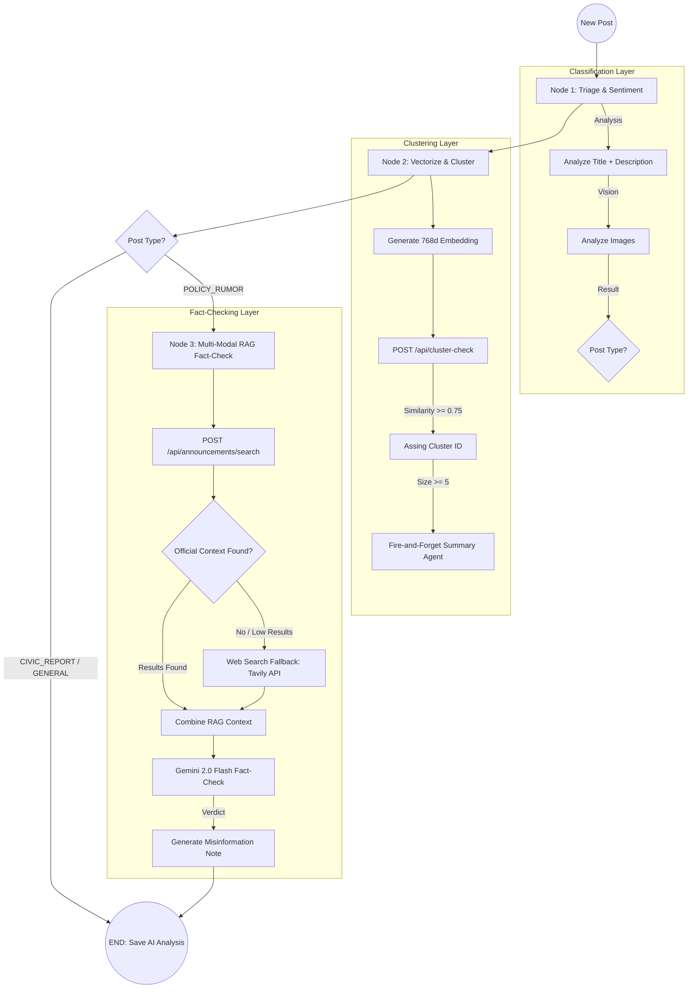

# UrbanConnect Civic Analysis LangGraph Workflow

This diagram illustrates the multi-modal RAG pipeline for post classification, clustering, and fact-checking.

## Node Descriptions

### **Node 1: Triage & Sentiment**
- **Inputs:** `title`, `description`, `image_urls`.
- **Purpose:** Classifies the post into `CIVIC_REPORT` (raw onsite issues), `POLICY_RUMOR` (claims requiring verification), or `GENERAL`.
- **Logic:** Uses Gemini 2.0 Flash for structured output.

### **Node 2: Vectorize & Cluster**
- **Inputs:** Combined text from Node 1.
- **Purpose:** Vectorizes the post and checks for emerging issues.
- **Workflow:** 
  1. Generates 768-dim vector.
  2. Hits Node.js `/cluster-check` to find siblings within a 12h window.
  3. If cluster size reaches 5, triggers the **Cluster Summary Agent**.

### **Node 3: Multi-Modal RAG Fact-Check**
- **Trigger:** Only runs if Post Type is `POLICY_RUMOR`.
- **Workflow:**
  1. Performs a vector search on the `announcements` collection.
  2. **Fallback:** If internal search finds < 2 releases, hits the **Tavily Web Search** for live ground truth.
  3. **Visual Verification:** Analyzes post images for forgery or contradictions.
  4. **Final Verdict:** Flags `is_misinformation` and generates a `context_note`.
