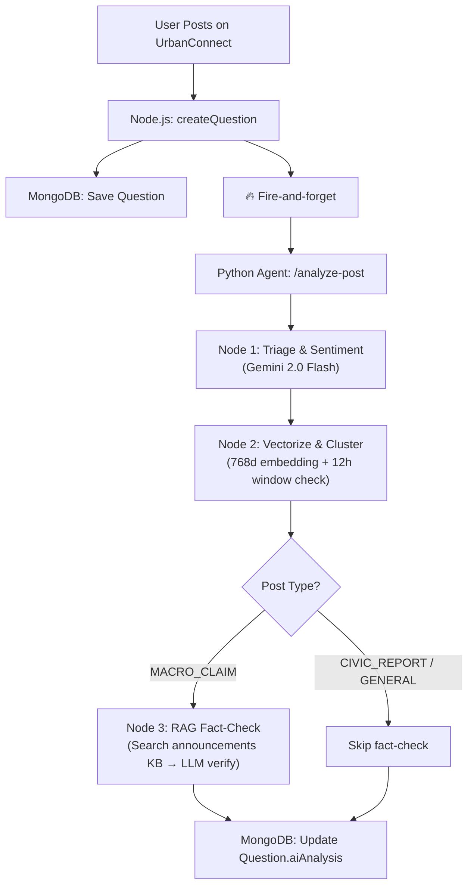

# UrbanConnect Civic Analysis RAG — Walkthrough

## What Was Built

A production-grade civic analysis pipeline that **automatically analyzes every UrbanConnect post** for sentiment, urgency, misinformation, and emerging issues — all via a fire-and-forget pattern that doesn't slow down the user experience.

## Architecture



## Files Changed

### New Files (10)

| File | Purpose |
|---|---|
| [announcementModel.js](file:///Users/aryangupta/Documents/Projects/dev/server/src/models/urbanconnect/announcementModel.js) | MongoDB model for synthetic official announcements |
| [civic_analysis_agent.py](file:///Users/aryangupta/Documents/Projects/dev/agents/brain/civic_analysis_agent.py) | 3-node LangGraph: triage → vectorize/cluster → RAG fact-check |
| [announcement.controller.js](file:///Users/aryangupta/Documents/Projects/dev/server/src/controllers/urbanconnect/announcement.controller.js) | GET feed + RAG vector search |
| [cluster.controller.js](file:///Users/aryangupta/Documents/Projects/dev/server/src/controllers/urbanconnect/cluster.controller.js) | Density-based clustering (12h window, cosine ≥0.85, ≥3 posts) |
| [announcement.routes.js](file:///Users/aryangupta/Documents/Projects/dev/server/src/routes/announcement.routes.js) | Routes for announcements API |
| [civicAnalytics.routes.js](file:///Users/aryangupta/Documents/Projects/dev/server/src/routes/civicAnalytics.routes.js) | Admin analytics endpoints (sentiment, clusters, misinformation) |
| [seedAnnouncements.js](file:///Users/aryangupta/Documents/Projects/dev/server/seedAnnouncements.js) | Seeds ~22 synthetic announcements from 5 officials with 768d embeddings |
| [CivicAnalytics.jsx](file:///Users/aryangupta/Documents/Projects/dev/client/src/pages/administration/CivicAnalytics.jsx) | Admin dashboard: charts, clusters, misinformation feed, posts table |
| [AnnouncementsTab.jsx](file:///Users/aryangupta/Documents/Projects/dev/client/src/components/urbanFlow/AnnouncementsTab.jsx) | Read-only announcements feed (dark theme, authority badges, city filter) |

### Modified Files (6)

| File | Change |
|---|---|
| [questionModel.js](file:///Users/aryangupta/Documents/Projects/dev/server/src/models/urbanconnect/questionModel.js) | Added `aiAnalysis` subdoc + [embedding](file:///Users/aryangupta/Documents/Projects/dev/agents/brain/job_agent.py#93-109) field |
| [main.py](file:///Users/aryangupta/Documents/Projects/dev/agents/main.py) | Added `/analyze-post` endpoint + [CivicAnalysisRequest](file:///Users/aryangupta/Documents/Projects/dev/agents/main.py#81-87) schema |
| [urbanconnect.controller.js](file:///Users/aryangupta/Documents/Projects/dev/server/src/controllers/urbanconnect.controller.js) | Fire-and-forget agent call in [createQuestion](file:///Users/aryangupta/Documents/Projects/dev/server/src/controllers/urbanconnect.controller.js#149-230) |
| [urbanconnect.route.js](file:///Users/aryangupta/Documents/Projects/dev/server/src/routes/urbanconnect.route.js) | Added cluster-check route |
| [app.js](file:///Users/aryangupta/Documents/Projects/dev/server/app.js) | Mounted announcements + civic-analytics routes |
| [Administration.jsx](file:///Users/aryangupta/Documents/Projects/dev/client/src/pages/administration/Administration.jsx) | Added Civic Analytics card to command systems |
| [App.jsx](file:///Users/aryangupta/Documents/Projects/dev/client/src/App.jsx) | Added `/administration/civic-analytics` route |

## Next Steps to Verify

1. **Seed the knowledge base** (requires Python agent running on port 10000):
   ```bash
   cd /Users/aryangupta/Documents/Projects/dev/server
   node seedAnnouncements.js
   ```

2. **Test the analyze-post endpoint**:
   ```bash
   curl -X POST http://localhost:10000/analyze-post \
     -H "Content-Type: application/json" \
     -d '{"postId": "test123", "title": "Water supply cut in Sector 5", "description": "No water since morning", "city": "Mumbai"}'
   ```

3. **Create a post via the UI** and verify `aiAnalysis` field appears in MongoDB after ~5-10 seconds
